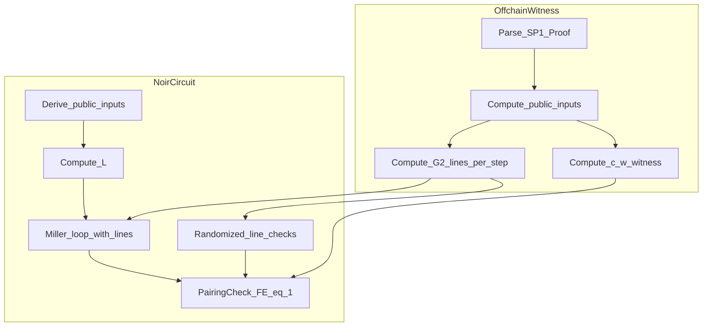

# Line-Witnessed PairingCheck Plan

## Goal

Reduce constraints by removing in-circuit G2 line arithmetic for SP1 proofs while keeping the PairingCheck sound. We’ll witness the line evaluations and verify them with randomized (compressed) checks, then reuse the existing `pairing_check_with_preimage` final-exponentiation shortcut.

## Why this is sound and expected to save constraints

- **Witnessed hints are sound only when constrained**: We will add explicit algebraic checks tying each witnessed line to the correct G2 doubling/addition formulas, compressed into base-field checks using a Fiat–Shamir challenge. This is the standard “hint + constraint” pattern; see circom’s non-deterministic assignment + constraint model and zkSecurity’s under-constraining warnings.
- **PairingCheck already removes full final exponentiation** (see `PAIRING_CHECK_OPTIMIZATION_SPEC.md`). Option A further removes all **G2 line computation** from the circuit, which is the dominant cost in the Miller loop per `OPTIMIZE.md`.
- **Expected savings**: similar optimizations in pairing circuits (e.g., fixed-line precomputation) show 5–15% savings per pairing; fully offloading line arithmetic should be materially larger in this codebase where G2 arithmetic is dominant. We will measure pre/post constraint counts to confirm.

## Implementation Plan

### 1) Add a line-witnessed Miller loop API

- Create a new API in `bn254_pairing` for the SP1 path that consumes **pre-evaluated line coefficients** instead of computing them.
- New types in [`bn254_pairing/src/g2.nr`](bn254_pairing/src/g2.nr):
  - `LineEvalAtP { r0: Fp2, r1: Fp2, r2: Fp2 }` (already line-evaluated at G1 point).
  - Optional `G2ProjWitness` if we decide to verify line correctness against projective states.
- New entrypoint in [`bn254_pairing/src/pairing.nr`](bn254_pairing/src/pairing.nr):
  - `miller_loop_with_lines_sp1(p_list: [G1Affine; 3], lines: LineScheduleSp1) -> Fp12`
  - `pairing_check_with_preimage_and_lines_sp1(..., t_preimage, c, w, lines) -> bool`
- The new Miller loop will only call:
  - `Fp12.mul_by_034`, `mul_034_by_034`, `Fp12.mul_by_01234`, and `Fp12.square`
  - It **will not** call `G2Proj.double_step/add_mixed_step/line_compute`.

### 2) Define the line schedule and ordering

- Introduce a deterministic line schedule for SP1’s fixed `N=3` pairing list (A,B), (C,delta_neg), (L,gamma_neg), mirroring the existing `miller_loop` order in [`bn254_pairing/src/pairing.nr`](bn254_pairing/src/pairing.nr).
- The schedule should include:
  - Initial double lines for each pair
  - The first fused `mul_034_by_034` pair
  - The pre-loop “square + (line_compute, add_mixed)” phase
  - All 63 NAF iterations (double line each iteration, plus conditional add lines)
  - Final Frobenius-addition lines
- **Representation**: a struct of fixed-size arrays, e.g. `LineScheduleSp1` with arrays sized to the exact number of steps. We’ll compute these sizes once by mirroring the loop_counter length (66) and the current loop structure.

### 3) Soundness: randomized compressed checks for line correctness

- Add a “compressed Fp2 check” helper in [`bn254_pairing/src/pairing.nr`](bn254_pairing/src/pairing.nr) or a new module:
  - For any Fp2 equation `a * b = c`, check `(a0 + rho*a1)*(b0 + rho*b1) == (c0 + rho*c1)` in Fp.
- We will verify (for **proof.b only**) that witnessed lines correspond to correct G2 transitions:
  - `double_step` constraints (tangent line coefficients and next `G2Proj` state)
  - `add_mixed_step` constraints (addition line coefficients and next state)
  - `line_compute` constraints (line coefficients for adding `q_neg` / Frobenius points)
- **Challenge derivation**: derive `rho` via Fiat–Shamir from in-circuit data (public inputs + proof points). This prevents the prover from choosing a “lucky” `rho`. We will reuse the existing SHA-256 machinery and map its digest to a field element.
- **Fixed points** (`delta_neg`, `gamma_neg`) can bypass randomized checks entirely if their line schedule is **hardcoded constants** (trusted VK data). This keeps constraints minimal and sound.

### 4) Wire the SP1 verifier to the new path

- In [`groth16_verify/src/verify.nr`](groth16_verify/src/verify.nr):
  - Add `verify_sp1_pairing_check_with_lines(...)` that calls the new line-witnessed pairing check.
  - Keep existing `verify_sp1_pairing_check` for comparison and fallback.
- In [`groth16_verify/src/sp1.nr`](groth16_verify/src/sp1.nr):
  - Expose a new entrypoint in `verify_sp1_pairing_check` that accepts the line schedule witness inputs.

### 5) Extend witness generation script

- Update [`groth16_verify/scripts/compute_sp1_pairing_check_witness.py`](groth16_verify/scripts/compute_sp1_pairing_check_witness.py) to emit:
  - Line schedule for **B** (variable): line coefficients pre-evaluated at `A`, `C`, and `L` in the exact circuit order.
  - Optional projective states for B if needed for compressed checks.
  - (Optional) Precomputed line schedules for fixed points (`delta_neg`, `gamma_neg`) as constants (or emit them once to generate a `sp1_fixed_lines.nr` file).
- The script already has full G2 arithmetic and Miller loop logic; we will instrument it to record `LineEvaluation` outputs at every step.
- Output format: JSON/TOML using the existing limb encoding (3×120-bit limbs per Fp) consistent with `sp1.nr` and current witness formats.

### 6) Tests and validation

- Add a regression test that verifies:
  - Old path (`verify_sp1_pairing_check`) == new path (`verify_sp1_pairing_check_with_lines`) on known SP1 proof vectors.
- Add an offline script check:
  - `final_exponentiation(f_t) == 1`
  - `f_t * w == c^lambda`
  - `w` in Fp6 (already validated)
- Measure constraint counts before/after using `nargo info` or current measurement tooling.

## Key Files to Change

- [`bn254_pairing/src/pairing.nr`](bn254_pairing/src/pairing.nr) (new line-witnessed Miller loop + randomized checks)
- [`bn254_pairing/src/g2.nr`](bn254_pairing/src/g2.nr) (line schedule types)
- [`groth16_verify/src/verify.nr`](groth16_verify/src/verify.nr) (new SP1 entrypoint)
- [`groth16_verify/src/sp1.nr`](groth16_verify/src/sp1.nr) (expose new API)
- [`groth16_verify/scripts/compute_sp1_pairing_check_witness.py`](groth16_verify/scripts/compute_sp1_pairing_check_witness.py) (emit line schedule)

## Data Flow Diagram

## External References Used for Validation

- Circom constraint generation and witness hints: https://docs.circom.io/circom-language/constraint-generation
- Under-constraining pitfalls: https://blog.zksecurity.xyz/posts/underconstrain-bugs/
- PairingCheck witness strategy (garaga BN254): https://github.com/keep-starknet-strange/garaga/blob/main/hydra/garaga/hints/multi_miller_witness.py?plain=1