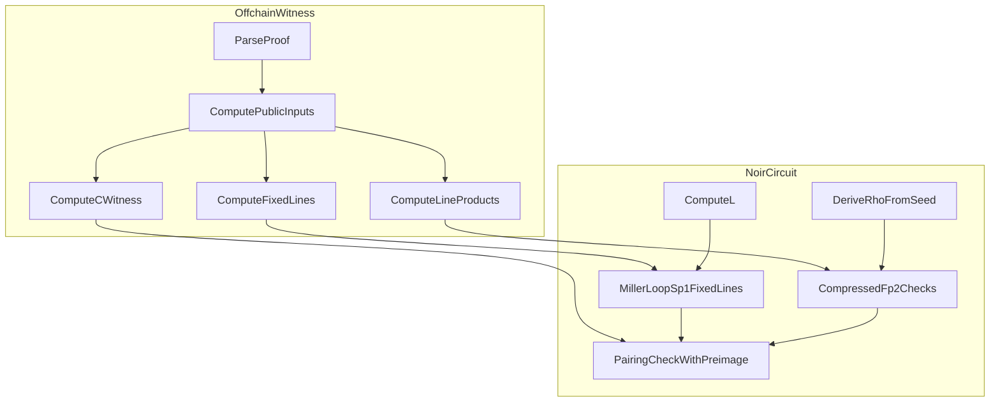

# SP1 PairingCheck Optimization Plan

## Evaluation summary (Option B + C)

- Option B is a safe, deterministic savings: delta/gamma are fixed, so all their G2 line coefficients can be precomputed once and embedded as constants. This removes repeated `double_step`/`add_mixed_step`/`line_compute` work for those two pairings and keeps full soundness because the lines are fixed and audited constants.
- Option C reduces the cost of `mul_034_by_034` by witnessing intermediate Fp2 products and verifying them with a single compressed Fp check per product (Schwartz–Zippel style). This is a standard technique in pairing circuits and requires a Fiat–Shamir challenge rho; to keep it sound in a non-interactive setting, rho must include a public random seed (verifier-chosen or outer-proof transcript) in the hash.
- Online references supporting these techniques: under-constrained witness pitfalls and the need for explicit checks (zkSecurity blog), pairing gadgets with line-function optimizations (circom-pairing), and line-witnessing strategies in practice (garaga multi_miller witness script).

## Plan

### 1) Map the exact SP1 Miller-loop line schedule and line-product sites

- Audit `miller_loop`/`miller_loop_div_c` usage in `bn254_pairing/src/pairing.nr` to enumerate every line emission and every `mul_034_by_034` site used by SP1 (`N=3` path).
- Document the exact order for:
  - Initial double lines (k=0,1,2)
  - Pre-loop `line_compute` + `add_mixed_step` phase
  - 63 NAF iterations (double line + optional add line)
  - Final Frobenius-add lines
- This schedule becomes the single source of truth for both fixed-line constants (Option B) and witness line-products (Option C).

### 2) Implement SP1-only Miller loop with fixed-G2 line constants (Option B)

- Add a new SP1-specialized Miller loop function (e.g., `miller_loop_sp1_fixed_lines`) in `bn254_pairing/src/pairing.nr` that:
  - Uses in-circuit G2 arithmetic only for proof `B`
  - Pulls precomputed line coefficients for `delta_neg` and `gamma_neg` from constants
  - Performs `line_eval_at_point` on those fixed lines using the dynamic G1 points (`C`, `L`)
- Create a new constants module (e.g., `bn254_pairing/src/sp1_fixed_lines.nr`) that exports fixed line arrays for `delta_neg` and `gamma_neg`, aligned to the schedule in step 1.
- Wire `groth16_verify/src/verify.nr` so `verify_sp1_pairing_check` calls a new `pairing_check_with_preimage_sp1_fixed_lines` instead of the generic `pairing_check_with_preimage`.

### 3) Add compressed Fp2 multiplication checks for `mul_034_by_034` (Option C)

- Introduce a helper in `bn254_pairing/src/pairing.nr` (or new module) to verify an Fp2 product with a single Fp check:
  - For `a*b=c`, enforce `(a0 + rho*a1)*(b0 + rho*b1) == (c0 + rho*c1)`.
  - Keep only the necessary additions and a single Fp multiplication to minimize constraints.
- Add a new witnessed version of `mul_034_by_034` (e.g., `mul_034_by_034_witnessed`) in `bn254_pairing/src/fp12.nr` that:
  - Takes `x0, x3, x4, x04, x03, x34` as witness inputs
  - Verifies each corresponding Fp2 multiply using the compressed check
  - Reconstructs the 5-slot product `[z00, x3, x34, x03, x04]` with cheap additions
- Replace all SP1-path `mul_034_by_034` calls in the new SP1 Miller loop with the witnessed version.

### 4) Derive rho in-circuit with a public randomness seed

- Extend `groth16_verify/src/sp1.nr` to derive `rho` via SHA256:
  - Input: `rho_seed` (new public input) plus a transcript over proof points and public inputs
  - Output: `rho = hash_to_field(sha256(...))`
- Pass `rho` into the SP1 pairing-check path.
- Note: the public `rho_seed` ensures the challenge is not chosen by the prover, preserving Schwartz–Zippel soundness in a non-interactive circuit.

### 5) Update witness generator for fixed lines and line-product witnesses

- Extend `groth16_verify/scripts/compute_sp1_pairing_check_witness.py` to:
  - Emit a `sp1_fixed_lines.nr` file containing delta/gamma line arrays (`--emit-fixed-lines` flag)
  - Emit per-step `mul_034_by_034` witness values aligned with the SP1 Miller loop schedule (`--emit-line-products` flag or as part of existing JSON/TOML output)
- Ensure the output uses existing limb encoding (`fp_to_limbs`) for consistency.

### 6) Validation and constraint measurement

- Add a regression test in `groth16_verify/src/sp1.nr` or `groth16_verify/src/verify.nr` comparing:
  - Old path (`verify_sp1_pairing_check`) vs new optimized path on known proof vectors.
- Measure constraints before/after with `nargo info` (or existing tooling) and record the delta.
- Verify the offline witness script still checks:
  - `final_exponentiation(f_t) == 1`
  - `f_t * w == c^lambda`
  - `w` in Fp6

## Key files to change

- `bn254_pairing/src/pairing.nr`
- `bn254_pairing/src/fp12.nr`
- `bn254_pairing/src/g2.nr`
- `bn254_pairing/src/sp1_fixed_lines.nr` (new)
- `groth16_verify/src/verify.nr`
- `groth16_verify/src/sp1.nr`
- `groth16_verify/scripts/compute_sp1_pairing_check_witness.py`

## Mermaid data flow

