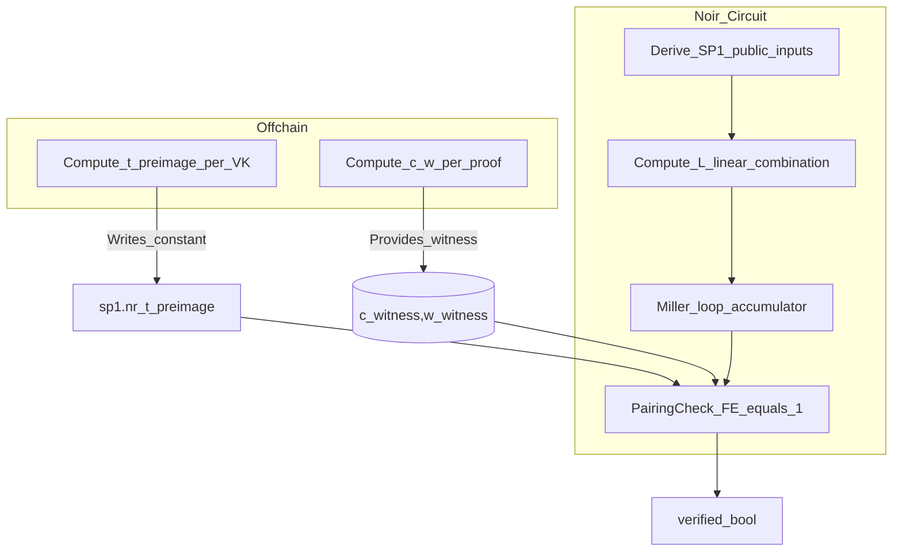

## PairingCheck optimization (Option B) for BN254 Groth16 verification (SP1 focus)

This document is a **step-by-step spec** for implementing the “PairingCheck shortcut” described in `bn254_pairing/PAIRING_OPTIMIZATION_ASSESSMENT.md` (Optimization 6), using **Option B (Fp12 preimage)** for the SP1 Groth16 verifier in `groth16_verify/`.

The reference implementation you shared (garaga) implements the *same* method: it supports multiplying the Miller loop accumulator by an optional Fp12 factor `m` (your preimage `t`) and then performs a **witnessed “final exponentiation equals 1”** check instead of computing the full final exponentiation. See `MultiPairingCheckCircuit.multi_pairing_check(..., m=...)` and `get_root_and_scaling_factor(..., m=...)` in:
- `https://github.com/keep-starknet-strange/garaga/blob/main/hydra/garaga/precompiled_circuits/multi_pairing_check.py`

---

## 1) Current baseline (what we do today)

### 1.1 Groth16 equation currently enforced

In `groth16_verify/src/verify.nr`, verification computes:

- \(L = IC_0 + \sum_i IC_{i+1}\cdot input_i\)
- checks:
  \[
  e(A,B)\cdot e(C,-\delta)\cdot e(L,-\gamma) \stackrel{?}{=} e(\alpha,\beta)
  \]

Concretely, the code does `pairing_multi([A, C, L], [B, delta_neg, gamma_neg])` and compares the resulting **Fp12 (GT) element** to `vk.alpha_beta` (which is already `e(alpha,beta)`).

### 1.2 Where the cost is

`pairing_multi` in `bn254_pairing/src/pairing.nr` is:
- `miller_loop(...)` (already optimized)
- `final_exponentiation(...)` (expensive, especially the hard part)

The optimization target is: **avoid computing the full final exponentiation output** when you only need a boolean check.

---

## 2) Option B (Fp12 preimage): core idea

### 2.1 Convert “equals constant” into “equals 1”

We want to avoid checking equality to a constant GT element directly. Multiply both sides by \(e(\alpha,\beta)^{-1}\) and check equality to the identity:

\[
e(A,B)\cdot e(C,-\delta)\cdot e(L,-\gamma)\cdot e(\alpha,\beta)^{-1} = 1
\]

Let:
- \(f = \text{MillerLoop}(A,B;\ C,-\delta;\ L,-\gamma)\in \mathbb{F}_{p^{12}}^\*\)
- \(\text{FE}(\cdot)\) be the full final exponentiation map:
  \[
  \text{FE}(z) = z^{h}\quad \text{where}\quad h=\frac{p^{12}-1}{r}
  \]

Then the existing check is:
\[
\text{FE}(f) \stackrel{?}{=} \alpha\_\beta
\]

Option B chooses a **constant preimage** \(t\in \mathbb{F}_{p^{12}}^\*\) such that:
\[
\text{FE}(t) = \alpha\_\beta^{-1}
\]

Then:
\[
\text{FE}(f\cdot t) = \text{FE}(f)\cdot \text{FE}(t) = \alpha\_\beta \cdot \alpha\_\beta^{-1} = 1
\]

So verification becomes:
- compute \(f\_t := f \cdot t\) (where `t` is a *VK-dependent constant*)
- check:
  \[
  \text{FE}(f\_t) = 1
  \]

### 2.2 Why this helps

Computing \(\text{FE}(f\_t)\) in-circuit is expensive. Instead, we prove **“\(\text{FE}(f\_t)=1\)”** via a cheaper, witness-aided check (“PairingCheck”).

This is exactly what gnark’s `PairingCheck` does conceptually, and what garaga implements with extra witnesses (below).

---

## 3) Mapping to the garaga reference (validation that it’s the same method)

Garaga’s BN254 pairing check computes:
- \(f \leftarrow \text{MillerLoop}(\{(P_i,Q_i)\})\)
- optionally multiplies by a supplied Fp12 element `m`:
  - `if m is not None: f = f * M` (where `M` is the Fp12 element represented by `m`)
- then runs a pairing check that asserts the final result equals 1.

This is Option B verbatim:
- your constant preimage `t` is garaga’s optional `m`
- your goal “FE(miller_product * t) == 1” is exactly garaga’s “pairing check succeeded” branch

Reference code paths:
- `get_root_and_scaling_factor(..., m=...)`: multiplies the Miller output by `m` before computing witnesses
- `MultiPairingCheckCircuit.multi_pairing_check(..., m=...)`: consumes those witnesses and asserts the final result is 1

Source:
- `https://github.com/keep-starknet-strange/garaga/blob/main/hydra/garaga/precompiled_circuits/multi_pairing_check.py`

---

## 4) The PairingCheck relation used (BN254)

### 4.1 What the witness proves (high-level)

Garaga constructs witnesses \((c,w)\) such that for the target \(f\_t = f\cdot t\):

\[
f\_t \cdot w = c^{\lambda}
\]

where:
- \(w\) lies in a subfield (for BN254, it is chosen in \(\mathbb{F}_{p^6}\subset \mathbb{F}_{p^{12}}\))
- \(\lambda\) is a BN-curve-specific exponent:
  \[
  \lambda = 6x + 2 + p - p^2 + p^3
  \]
  where \(x\) is the BN parameter (the same one driving the optimal-Ate loop).

Garaga’s `get_final_exp_witness` explicitly documents this:
> “Returns the witnesses c, w for the final exponentiation step, such that `f*w = c^lambda` and `w` lies in a subfield of Fq12.”

The witness-gen logic (BN254 branch) lives in:
- `https://github.com/keep-starknet-strange/garaga/blob/main/hydra/garaga/hints/multi_miller_witness.py?plain=1`

### 4.2 How the circuit checks it cheaply

Computing \(c^\lambda\) directly in-circuit would be expensive. The trick is to **reuse the Miller-loop structure** for the \(6x+2\) part and use **Frobenius maps** for the \(p - p^2 + p^3\) part:

- \(\phi(z) = z^{p}\) is the Frobenius endomorphism in \(\mathbb{F}_{p^{12}}\)
- \(\phi^k(z) = z^{p^k}\) can be computed cheaply with precomputed constants (your `Fp12.frobenius_*` already does this)

Observe:
\[
c^{\lambda} = c^{6x+2}\cdot c^{p}\cdot c^{-p^2}\cdot c^{p^3}
\]

So:
\[
f\_t\cdot w \cdot c^{-\lambda} = 1
\]

Garaga computes a modified Miller accumulator that effectively yields \(f\_t \cdot c^{-(6x+2)}\), and then multiplies by the remaining Frobenius terms to finish \(c^{-\lambda}\).

Concretely, garaga’s final check (BN254 branch) multiplies by:
- \(w\)
- \(\phi(c^{-1})\) (i.e., \(c^{-p}\))
- \(\phi^2(c)\) (i.e., \(c^{p^2}\))
- \(\phi^3(c^{-1})\) (i.e., \(c^{-p^3}\))

So the asserted product is:
\[
\Bigl(\frac{f\_t}{c^{6x+2}}\Bigr)\cdot w \cdot c^{-p}\cdot c^{p^2}\cdot c^{-p^3} = 1
\]
which simplifies to:
\[
f\_t \cdot w \cdot c^{-\lambda} = 1
\]

That is exactly the desired witness relation.

---

## 5) Target integration for this repo (SP1-first, Option B)

### 5.1 Keep SP1 verifying key type unchanged (per your preference)

You chose to **not** extend `VerifyingKey`. So we will:
- keep `VerifyingKey` as-is (`groth16_verify/src/types.nr`)
- embed an SP1-only constant `t_preimage` in `groth16_verify/src/config/sp1.nr`

### 5.2 New verifier flow (SP1 fast path)

Replace:
- compute GT result = `pairing_multi(...)` (Miller + full FE)
- compare to `vk.alpha_beta`

with:

1) Compute \(L\) as today (same MSM / linear combo)

2) Compute raw Miller-loop product (no FE):
- \(f = \text{miller\_loop}([A, C, L], [B, \delta\_neg, \gamma\_neg])\)

3) Multiply by the constant preimage:
- \(f\_t = f \cdot t\_\text{preimage}\)

4) Run PairingCheck for “FE == 1”:
- accept witnesses `(c, w)` as *private inputs*
- assert the pairing-check identity (Section 6) holds

5) Return boolean success

### 5.3 Data flow diagram

### 5.3 Expected circuit API shape

Add a new helper in `noir_bn254_pairing` (or in `groth16_verify/verify.nr` if you want to keep it local at first):

- `pairing_check_with_preimage<let N: u32>(p_list: [G1Affine; N], q_list: [G2Affine; N], t_preimage: Fp12, c: Fp12, w: Fp12) -> bool`

For SP1 specifically, you’d likely bake `t_preimage` as a constant (from `sp1.nr`) and expose:

- `verify_sp1_fast_pairing_check(proof, public_inputs, c, w) -> bool`

where `c` and `w` are additional witness values provided alongside the Groth16 proof.

### 5.4 Recommended API design (minimal disruption)

Keep the current API unchanged for baseline comparisons, and add a new entrypoint that requires the extra witness values:

- Existing:
  - `verify_sp1(vkey, public_values, proof) -> bool` (keeps using `pairing_multi`)
- New:
  - `verify_sp1_pairing_check(vkey, public_values, proof, c, w) -> bool`

This avoids needing to compute `(c,w)` inside Noir and makes the dependency explicit.

---

## 6) Circuit constraints to implement (BN254 PairingCheck)

This section is the “specs as equations” for the new constraint system.

### 6.1 Inputs

- **Public / existing**
  - proof points: \(A\in G1\), \(B\in G2\), \(C\in G1\)
  - public inputs: same as today (SP1: 2 scalars derived from `vkey` and `public_values`)
  - VK constants: `ic[]`, `gamma_neg`, `delta_neg`, `alpha_beta` (already in `sp1.nr`)

- **New constant (VK-dependent)**
  - `t_preimage ∈ Fp12`: constant s.t. `final_exponentiation(t_preimage) == alpha_beta^{-1}`

- **New witness (per proof)**
  - `c ∈ Fp12`: the “lambda-root” witness
  - `w ∈ Fp12`: the “scaling factor” witness, constrained to be in **Fp6** (subfield)

### 6.2 Mandatory validity checks (unchanged)

Keep all existing proof validity checks from `groth16_verify/src/verify.nr`:
- G1 on-curve for `A`, `C`
- G2 on-curve and subgroup check for `B`
- reject infinity points

These remain required for soundness.

### 6.3 Subfield constraint for `w`

Enforce \(w\in \mathbb{F}_{p^6}\subset \mathbb{F}_{p^{12}}\).

In this repo’s representation `Fp12 { c0: Fp6, c1: Fp6 }`, “Fp6 subfield” means:
- `w.c1 == 0` (all coefficients zero)

This must be an **actual constrained equality**, not an off-circuit assumption.

### 6.4 PairingCheck identity to enforce

Define:
- \(f = \text{MillerLoop}([A, C, L], [B, \delta\_neg, \gamma\_neg])\)
- \(f\_t = f \cdot t\_\text{preimage}\)

The PairingCheck must assert:

\[
\text{FE}(f\_t) = 1
\]

using the witness relation:

\[
f\_t \cdot w = c^\lambda
\quad\text{with}\quad
\lambda = 6x + 2 + p - p^2 + p^3
\]

To avoid exponentiating by \(\lambda\), enforce the equivalent constrained identity:

\[
\Bigl(\frac{f\_t}{c^{6x+2}}\Bigr)\cdot w \cdot c^{-p}\cdot c^{p^2}\cdot c^{-p^3} = 1
\]

**Implementation note:** the only hard part is producing \(\frac{f\_t}{c^{6x+2}}\) cheaply. The intended method is to compute it “inline” while running the Miller loop, by injecting `c` / `c^{-1}` multiplications per signed digit, as garaga does.

### 6.5 Modified Miller loop (the key change)

You already have an optimized multi-pair Miller loop (`bn254_pairing/src/pairing.nr`). The PairingCheck loop is a variant:

- Start the accumulator at \(c^{-1}\) instead of 1
- At each signed-NAF digit step, multiply by either \(c\) or \(c^{-1}\) so that the overall loop ends up dividing by \(c^{6x+2}\)

Garaga’s choice for BN254 is:
- if the signed digit is `+1`, multiply by `c_inv`
- if the signed digit is `-1`, multiply by `c`
- for the compressed 2-bit cases (`01`, `10`, `00`), multiply by `c`/`c_inv` the number of times that matches the algebra of the combined step

This avoids any explicit exponentiation by \(6x+2\), and reuses the same loop structure you’re already paying for to compute the Miller loop.

### 6.6 Final Frobenius-based correction (cheap)

After the modified Miller loop yields \(\frac{f\_t}{c^{6x+2}}\), apply:
- `w` (scaling factor)
- `frobenius(c_inv)` (power \(p\))
- `frobenius_square(c)` (power \(p^2\))
- `frobenius_cube(c_inv)` (power \(p^3\))

Then assert the result is exactly `Fp12.one()`.

---

## 7) Witness generation specs (scripts)

This section is meant to be implementable as a Python or Rust tool. The outputs are intended to be consumed as Noir witness inputs (e.g., through `Prover.toml` or a wrapper that produces inputs for `nargo prove`).

### 7.1 One-time precomputation: build `t_preimage` from `alpha_beta`

#### Goal

Compute a constant \(t\_\text{preimage}\in \mathbb{F}_{p^{12}}^\*\) such that:
\[
\text{FE}(t\_\text{preimage}) = \alpha\_\beta^{-1}
\]

#### Recommended construction (simple + deterministic)

Let:
- \(p\) be the BN254 base field modulus
- \(r\) be the BN254 scalar field order
- \(h = \frac{p^{12}-1}{r}\)

Since \(\alpha\_\beta\in GT\) has order \(r\), the map \(z \mapsto z^h\) is an automorphism of GT. Compute:

- \(g \leftarrow \alpha\_\beta^{-1}\)
- \(k \leftarrow h^{-1}\ \text{mod}\ r\)
- \(t\_\text{preimage} \leftarrow g^k\) (Fp12 exponentiation; exponent reduction mod \(r\) is valid since \(g\) has order \(r\))

Then:
\[
\text{FE}(t\_\text{preimage}) = t\_\text{preimage}^h = g^{k\cdot h} = g^{1\ (\text{mod }r)} = g = \alpha\_\beta^{-1}
\]

#### Required offline validation

Compute and assert:
- `final_exponentiation(t_preimage) == inverse(alpha_beta)`

Then serialize `t_preimage` into `groth16_verify/src/config/sp1.nr` in the same limb format as other constants.

### 7.2 Per-proof witness generation: compute `(c, w)` for `f_t`

#### Inputs

- Proof: \(A,B,C\)
- Public inputs: SP1 derives two scalars (same as the Noir circuit)
- VK constants: `ic[]`, `gamma_neg`, `delta_neg`
- Constant: `t_preimage`

#### Outputs (new witness values)

- `c` (Fp12): “lambda-root”
- `w` (Fp12, constrained to Fp6): “scaling factor”

#### Step-by-step algorithm

1) **Recompute the public inputs exactly as the circuit does**
   - `input0 = vkey`
   - `input1 = sha256(public_values)` masked to 253 bits (match Noir)

2) **Compute the linear combination point \(L\)**
   \[
   L = IC_0 + IC_1\cdot input0 + IC_2\cdot input1
   \]
   Use a correct BN254 scalar mul + affine add (arkworks recommended).

3) **Compute the raw multi Miller loop (no final exponentiation)**
   \[
   f = \text{MillerLoop}([A, C, L], [B, \delta\_neg, \gamma\_neg])
   \]

4) **Apply the Option B preimage**
   \[
   f\_t = f \cdot t\_\text{preimage}
   \]

5) **Compute witnesses \((c,w)\) such that \(f\_t \cdot w = c^\lambda\)**

Garaga’s BN254 witness algorithm can be ported directly. In pseudocode, using the same naming as garaga:

- **Constants:**
  - \(q := p\)
  - \(r := \#G1 = \#G2\) (BN254 scalar order)
  - \(h := (q^{12}-1)/r\)
  - \(\lambda := 6x + 2 + q - q^2 + q^3\)
  - a fixed 27th root of unity `root_27th` (see below)

- **Choose `s ∈ {0,1,2}` to land in the cube-residue subgroup**
  - Let `exp = (q^12 - 1) / 3`
  - Pick `s` so that:
    \[
    (f\_t \cdot root\_27th^s)^{exp} = 1
    \]
  - Set:
    - `w = root_27th^s`
    - `u = f_t * w`

- **Compute an r-th root**
  - Compute \(r^{-1}\ \text{mod}\ h\)
  - Set \(u_1 := u^{r^{-1}\ (\text{mod }h)}\)
  - Then \(u_1^r = u\)

- **Compute the “m′-dash” root (garaga’s `get_m_dash_root`)**
  - Let \(m = \lambda / r\) (λ is a multiple of r on BN curves)
  - Let \(d = \gcd(m, h)\)
  - Let \(m' = m/d\)
  - Compute \(m'^{-1}\ \text{mod}\ h\) and set:
    \[
    u_2 := u_1^{(m')^{-1}\ (\text{mod }h)}
    \]

- **Take a cube root (modified Tonelli–Shanks for cube roots)**
  - Decompose \(q^{12}-1 = 3^k \cdot s\) with \(3 \nmid s\)
  - Apply the modified TS loop to get \(u_3\) such that \(u_3^3 = u_2\)

  A direct pseudocode transcription of garaga’s `find_cube_root` (BN254 case) is:

  - Let `one = 1_Fp12`
  - Let `a = u2`
  - Let `w = root_27th` (a cube non-residue in the extension)
  - Let `q12m1 = q^12 - 1`
  - Write `q12m1 = 3^r * s` with `3 ∤ s`
  - Set `exp = (s + 1) / 3`
  - Initialize:
    - `x = a^exp`
    - `a_inv = a^{-1}`
    - `t = ord_3( (x^3) * a_inv )` where `ord_3(z)` is the smallest `t >= 0` s.t. `z^(3^t) == 1`
  - While `t != 0`:
    - `x = x * w^exp`
    - `t = ord_3( (x^3) * a_inv )`
  - Output `x` (which satisfies `x^3 == a`)

  This is intentionally “not optimized”; it is witness-gen only.

- **Return**
  - `c = u_3`
  - `w = root_27th^s`

This produces witnesses satisfying:
\[
f\_t \cdot w = c^\lambda
\]

**Where to find the exact reference logic:**
- witness construction is in:
  - `https://github.com/keep-starknet-strange/garaga/blob/main/hydra/garaga/hints/multi_miller_witness.py?plain=1`

#### Fixed 27th root constant (BN254)

Garaga uses a fixed 27th root of unity (not a 9th root) as an Fp12 element. The values can be copied from garaga if you choose to implement the same algorithm verbatim:
- `https://github.com/keep-starknet-strange/garaga/blob/main/hydra/garaga/hints/multi_miller_witness.py?plain=1`

#### Required offline validations (per proof)

For safety and debugging, the script should verify:
- `final_exponentiation(f_t) == 1` (full check, offline only)
- `f_t * w == c^lambda` (direct check, offline only)
- `w ∈ Fp6` (i.e., its “Fp12.c1” half is zero)

### 7.3 Output format for Noir inputs

This repo uses 3 limbs of 120 bits (`[u128; 3]`) for BN254 base field elements (see `compute_sp1_msm2_table_w3.py` and `sp1_verify_example/scripts/convert_sp1_proof.py`).

For new witnesses:
- represent `c` as 12 base-field coefficients (Fp12) in the repo’s nested structure order
- represent `w` similarly (but enforce and output zeros for the Fp12 “c1” half)

The script should output either:
- a `Prover.toml` snippet with fields matching the updated Noir entrypoint, or
- a JSON file that a small “converter” script turns into `Prover.toml`

---

## 10) Appendix: coefficient ordering and limb encoding (practical)

### 10.1 Limb encoding (base field `Fp`)

This repo encodes BN254 base-field elements as three `u128` limbs in little-endian limb order:

- `LIMB_BITS = 120`
- `value = limb0 + limb1 * 2^120 + limb2 * 2^240`

This is the same convention used by `sp1_verify_example/scripts/convert_sp1_proof.py` and `groth16_verify/scripts/compute_sp1_msm2_table_w3.py`.

### 10.2 `Fp12` coefficient order (12 base-field elements)

In this repo:

- `Fp2 = c0 + c1 * u`
- `Fp6 = b0 + b1 * v + b2 * v^2` where each `bi` is `Fp2`
- `Fp12 = c0 + c1 * w` where each `ci` is `Fp6`

So an `Fp12` has 12 base-field coefficients in this natural “nested struct” order:

1. `c0.b0.c0`
2. `c0.b0.c1`
3. `c0.b1.c0`
4. `c0.b1.c1`
5. `c0.b2.c0`
6. `c0.b2.c1`
7. `c1.b0.c0`
8. `c1.b0.c1`
9. `c1.b1.c0`
10. `c1.b1.c1`
11. `c1.b2.c0`
12. `c1.b2.c1`

For the PairingCheck witnesses:
- `c` is a full `Fp12` (all 12 coefficients can be non-zero)
- `w` must be in `Fp6` embedded into `Fp12`, meaning coefficients 7..12 are all zero.

---

## 8) Implementation checklist (what to code/change)

### 8.1 `bn254_pairing/`

- Add a PairingCheck implementation for BN254:
  - new function that runs a **modified Miller loop** + final Frobenius correction + equality-to-one check
  - reuses `Fp12.mul_by_034`, `mul_034_by_034`, and existing line evaluation patterns where possible

### 8.2 `groth16_verify/`

- Add SP1-only constant `t_preimage` to `groth16_verify/src/config/sp1.nr`
- Add a new SP1 verifier entrypoint that accepts `(c,w)` as witness inputs and returns `bool`
- Keep the existing verifier for comparison / fallback (optional but useful while rolling out)

### 8.3 Examples / tooling

- Update `sp1_verify_example` to accept the new witness inputs and demonstrate the optimized path (once implementation exists)
- Add scripts:
  - compute and print the constant `t_preimage`
  - compute per-proof witnesses `(c,w)`

---

## 9) Notes on security / soundness

This optimization is only sound if:
- the circuit **fully constrains** the PairingCheck identity (no unconstrained shortcuts)
- the scaling factor `w` is constrained to the intended subfield (at minimum `Fp6`), otherwise the prover can trivially satisfy `f_t*w=c^λ` by choosing `w` freely
- all existing curve validity checks remain in place for prover-controlled points

For broader context and pairing-proving discussions:
- `https://eprint.iacr.org/2024/640`
- `https://hackmd.io/@ivokub/SyJRV7ye2`
- `https://hackmd.io/@yelhousni/emulated-pairing`

